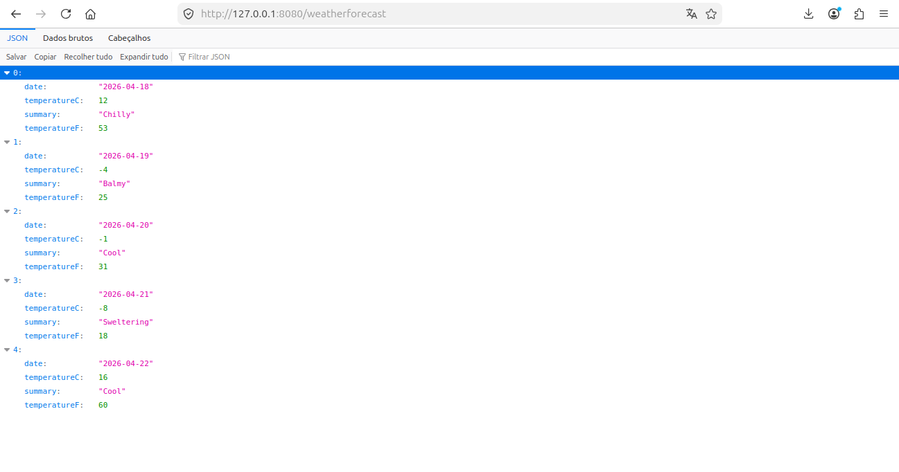

# Iniciando um projeto .NET Core DDD com Docker
\
\
**Buildando o projeto:**
\
docker build -t test_netcore .
\
\
**Executando o container em segundo plano e porta especifica:**
\
docker run -d -p 8080:8080 --name test_netcore  test_netcore .
\
\
**Agora executa com a variável de ambiente para desenvolvimento**
\
docker run -e ASPNETCORE_ENVIRONMENT=Development -p 8080:8080 test_netcore
\
\
Abrindo no navegador esta url: http://127.0.0.1:8080/weatherforecast, é para ter algo parecido com a imagem:
\
\
